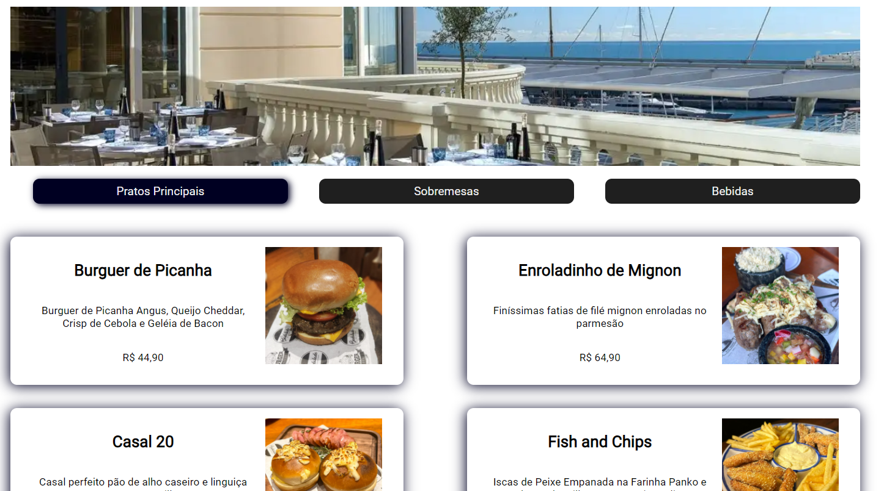

# Menu virtual de restaurante 
Menu interativo criado em web view com intuito de ser utilizado por restaurantes como cardápio virtual, ou até mesmo em pedidos e-commerce. O projeto foi realizado utilizando React.js, e que, por sua vez, engloba códigos HTML/CSS e JavaScript.

 > [!NOTE]
 > _Projeto desenvolvido durante o evento <b>Intensivão de JavaScript</b> da Hashtag Treinamentos._

----

## Restaurant virtual Menu
Interactive menu created in web view with the intention of being used by restaurants as a virtual menu, or even in e-commerce orders. The project was developed using React.js, which includes HTML/CSS and JavaScript code.

 > [!NOTE]
 > _Project developed during Hashtag Trainings' JavaScript Intensivão event._
 

